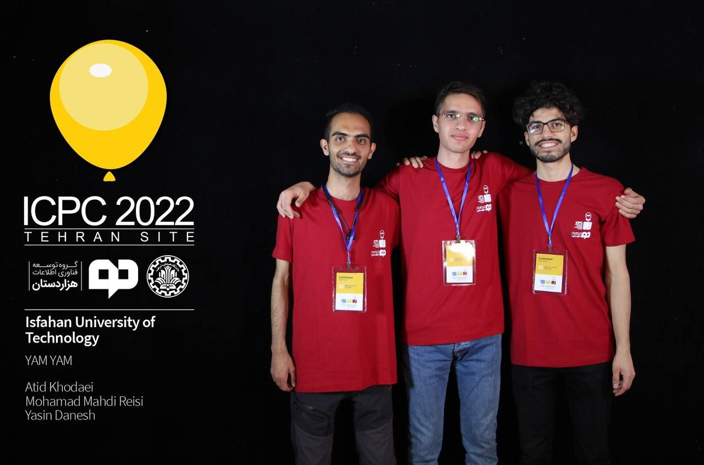
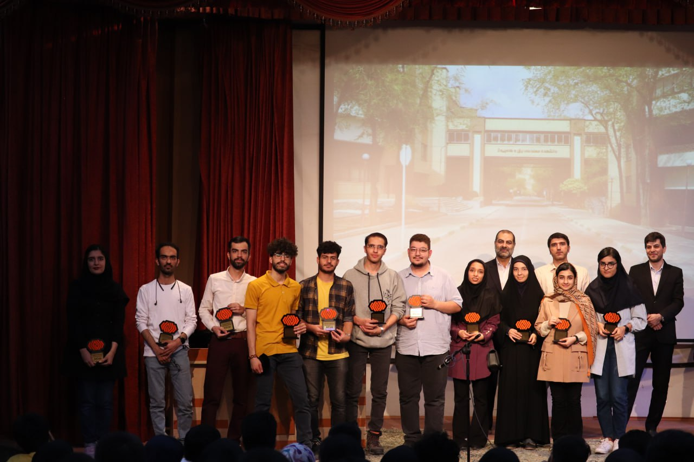

Below are some memorable events I've participated in, with photos and brief descriptions.

---

## Organizing CTF Competition 2023

    
    
    

 
**Description:** Served as a staff member for the national Capture The Flag (CTF) competition, where I helped design challenges and manage the event logistics.

---

## AI Coding Contest 2023

  
**Description:** Participated as the chairman of the AICup coding contest, where over 1000 contestants showcased their AI algorithms in problem-solving challenges.

-

---

## Event 3: [Event Name]

  
**Description:** Brief description of the event, your role, or any significant takeaway.

---

## Event 4: [Event Name]

  
**Description:** Brief description of the event, your role, or any significant takeaway.
